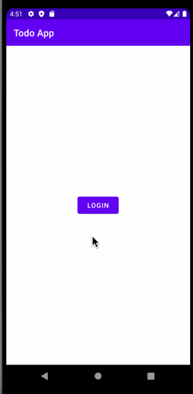

# Simple Todo App
This is a simple todo app. It can add, delete and update task. Task contains task name, due date, priority, and completion status.
The guideline of using app is detailed below.

## 1. Starting app
On clicking the app, a splash activity opens that shows fullscreen display and welcome text.

***
***
## 2. User Login
After that, user clicks on login button to login in to the app.

## 3. Task Functions
Tasks can be added, updated, and deleted through different ways.

###  a. Add task
On clicking the + button, a fragment containg options will be displayed.
Options contains task title,  calender to set date.priority High, Medium or Low
On clicking add button, the task is created and shown in task list.

### c. Update task
Task can be edited either by clicking on task. The details of task is shown in respective
fields and we can edit and update them by clicking on update button.

### d. Delete single task
Task can be deleted either by swiping left or right.

### e. Delete all tasks
All tasks can be deleted at once. This can be done by clicking on the menu in the toolbar and 
selecting delete all option.

## 4. Save data on rotation
Data is saved when device rotates.

## 5. Logout
User can logout by clicking on the menu and selecting logout option.

